# StarkExt

Un plugin de Vscode para la **Comunidad de Desarrolladores de [Starknet](https://www.starknet.io/en)** con el que pueden realizar las siguientes funciones:

## Instalación

Descargue el archivo vsix de nuestra versión [interna](https://github.com/7finney/starkex/releases/tag/v0.0.1) e instale en vscode.

## Características

- Crear cuenta
- Desplegar cuenta
- Compilar contratos inteligentes Cairo
- Declarar contratos inteligentes Cairo
- Desplegar contratos inteligentes de Cairo
- Interacción con los contratos inteligentes de Cairo
- Instrucciones de uso de StarkExt
- Creación de cuentas

# Instrucciones de uso de Starkex

## Creación de cuenta


## Despliegue de contratos e interacción


1. **Activar extensión starkex:** 
    - Una nueva carpeta con el título `starkex` generar en el directorio de trabajo actual para almacenar los registros de contratos.
    
2. **Seleccionar red starknet:**
    - Actualmente, la extensión sólo soporta la red `goerli-alpha`. **(seleccionar únicamente la red `goerli-alpha` para la ejecución de contratos)**.
3. **Crear nueva cuenta starkex:**
    - Crea una nueva cuenta no desplegada para la interacción con el contrato.
    - Utiliza los estándares de cuentas de openzeppelin.
4. **Seleccionar cuenta starkex no desplegada:**
    - Selecciona la cuenta no desplegada para su despliegue.
5. **Desplegar nueva cuenta starkex:**
    - Desplegar la cuenta no desplegada seleccionada en la cadena.
6. **Seleccionar cuenta starkex:**
    - Seleccione una cuenta desplegada en la cadena para la interacción del contrato.
    - Las cuentas desplegadas en la cadena se utilizan para la interacción del contrato.
7. **Seleccionar contrato de Cairo:**
    - Seleccione un contrato Cairo compilado.
    - El archivo .json debe estar presente en el directorio raíz del proyecto.
    - Después de seleccionar el contacto se generará una carpeta con dos archivos en la carpeta starkex.
        - `starkex/fileName/fileName_address.json` almacena la dirección y la información classHash del contrato cairo.
        - `starkex/fileName/fileName_abi.json` contiene abi del contrato de El Cairo seleccionado para la interacción con el contrato.
8. **Declare contrato de Cairo:**
    - Declarar el contrato de Cairo seleccionado en la cadena. (**Nota:** antes de declarar y desplegar el contrato, el classHash del contrato seleccionado debe estar presente en el campo `starkex/fileName/fileName_address.json.` classHash.
9. **Despliegue un contrato de Cairo**
    - Despliega el contrato cairo seleccionado en la cadena.
    - Pegar la dirección del contrato desplegado en el campo address del fichero `starkex/fileName/fileName_address.json.`.
10. **Llamar método de contacto:**
    - Llamar a los métodos de contrato presentes en el contrato de cairo.
    - La función de tipo vista puede ser llamada simplemente seleccionando el contrato.
    - Otras funciones pueden ser llamadas introduciendo valores en el archivo JSON.
        
        `starkex/fileName/fileName_abi.json`


## Tutorial StarknetEs

Primero clonamos el repositorio en el que se encutran todos los archiuvos de la extensión necesarios para el tutorial.  Para hacer esto, abrimos la terminal y escribimos el siguiente comando:

```bash
gh repo clone 7finney/starkex
```

## Descargar la extensión de VS Code:

Después de clonar el repositorio, debemos descargar la extensión de VS Code que se utiliza para interactuar con StarkNet. Para hacer esto, visitamos la página de lanzamientos del repositorio y descargamos el archivo [`vsix`](https://github.com/7finney/starkex/releases) de la última versión disponible.

Una vez descargado, abrimos VS Code y vamos a la sección de extensiones. Hacemos clic en los tres puntos y luego en `Instalar desde archivo VSIX`. Seleccionamos el archivo que descargamos anteriormente y esperamos a que se instale la extensión.

Por último refrescamos la aplicación y ya debería estar instalada y activa.

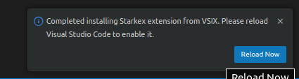


## Crear una cuenta en StarkNet:

Para utilizar StarkNet, debemos crear una cuenta en la red. Para hacer esto, abrimos la paleta de comandos de VS Code (Control + Shift + P) y buscamos `StarkNet: Create starkex new account`. 

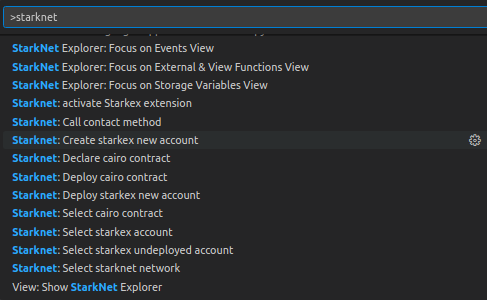

Vemos que el contrato aparace en la blockchain pero no se ha desplegado.

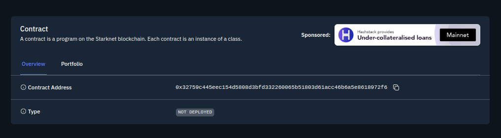

* [Contrato de Cuenta](https://testnet.starkscan.co/contract/0x32759c445eec154d5808d3bfd332260065b51803d61acc46b6a5e8618972f6)

## Desplegar

Para desplegar un contrato en StarkNet, necesitamos tener una pequeña cantidad de Ether en la cuenta de StarkNet. Pero primero dejaremos preparado la network, abrimos la paleta de comandos de VS Code (Control + Shift + P) y buscamos`Starknet: Select starknet network` 

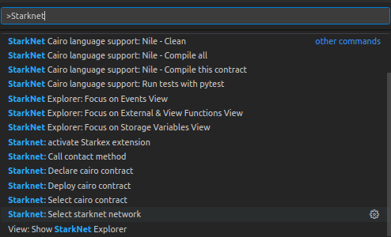

En nuestro caso escogimos `goerli-alpha`

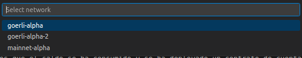

Ahora si procederemos hacer un envío de 0.02 de eth para que se despliegue la cuenta de starkex y tenga saldo para operar.

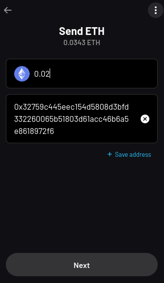

En caso de error al hacer el envío, puede ser debido a la falta de un numero que no detectó `Argent` en este tutorial asi que añadir un `0` a continuación de `x` quedando `0x0XXXXX`. (En Braavos no tuvimos problemas). Puede revisar su balance en la cuenta que vamos a desplegar

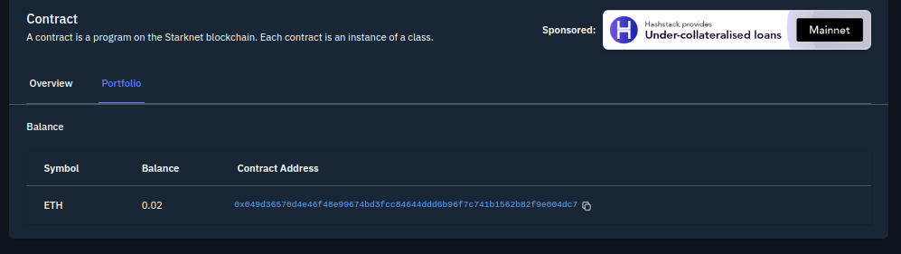

## Configurar la cuenta a desplegar:

Antes de desplegar un contrato, debemos configurar la cuenta de deployer en la extensión de StarkNet. Para hacer esto, abrimos la paleta de comandos de VS Code (Control + Shift + P) y buscamos `StarkNet: Select starkex undeployed account`. Seleccionamos la cuenta que acabamos de crear.

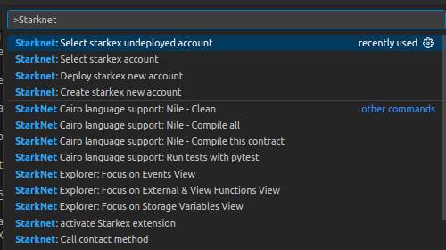

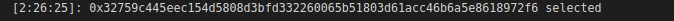


Ahora si podremos proceder a desplegar nuestra cuenta con el comando ` Starknet: Deploy starkex new account`, la cual podrá comprobar que se ha desplegado una vez aceptada y como su balance se ha consumido.

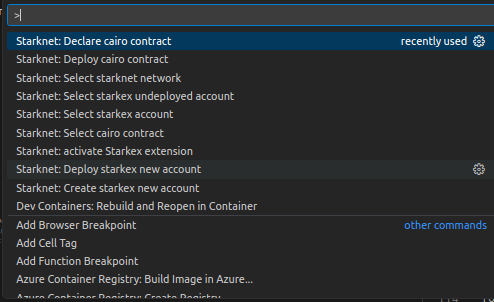

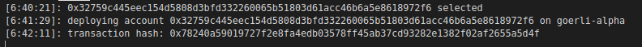

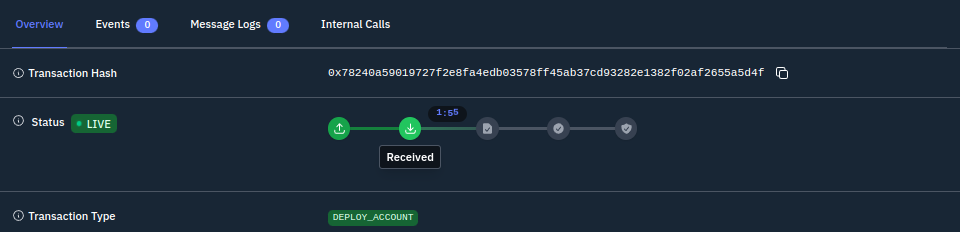

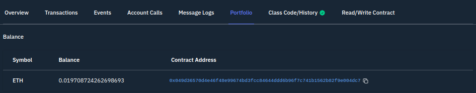

Luego podemos revisar el [Hash](https://testnet.starkscan.co/tx/0x078240a59019727f2e8fa4edb03578ff45ab37cd93282e1382f02af2655a5d4f)

Veremos que el saldo se ha consumido y se ha deployado un contrato de cuenta de OZ en la que podrá revisar su implemetación.

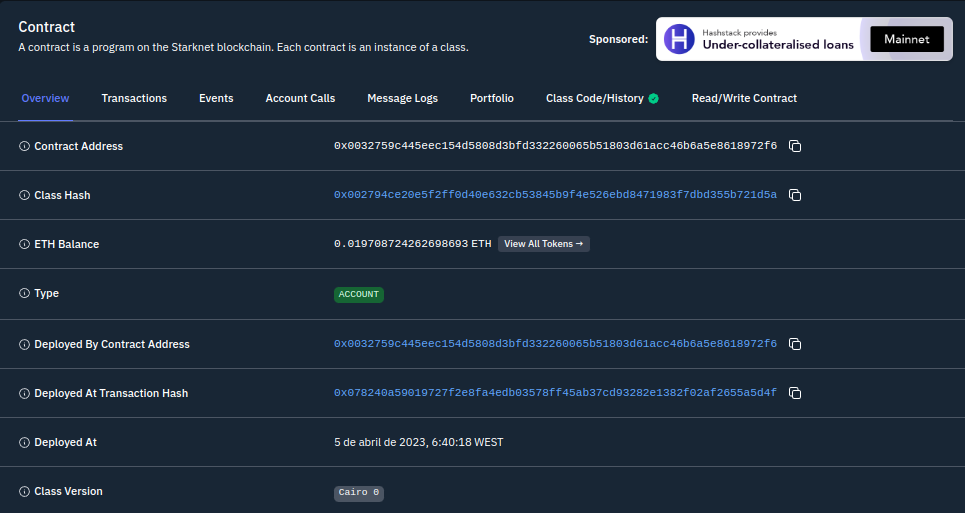

